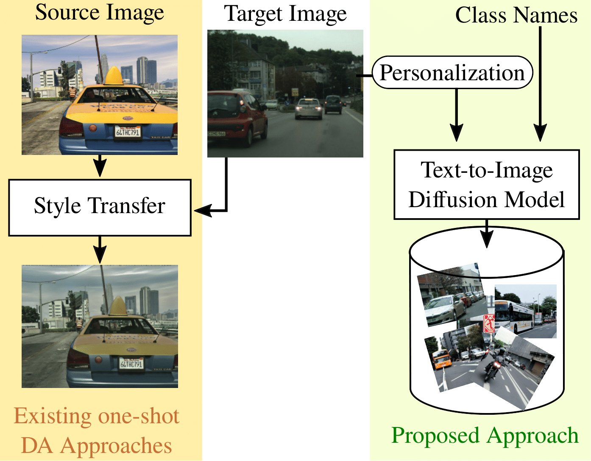

## Overview
[](https://paperswithcode.com/sota/one-shot-unsupervised-domain-adaptation-on?p=one-shot-unsupervised-domain-adaptation-with)
[](https://paperswithcode.com/sota/one-shot-unsupervised-domain-adaptation-on-1?p=one-shot-unsupervised-domain-adaptation-with)


Adapting a segmentation model from a labeled source
domain to a target domain, where a single unlabeled datum
is available, is one of the most challenging problems in
domain adaptation and is otherwise known as **one-shot unsupervised
domain adaptation (OSUDA)**.

Most of the prior
works have addressed the problem by relying on style transfer
techniques, where the source images are stylized to have
the appearance of the target domain. Departing from the
common notion of transferring only the target “texture” information,
we **leverage text-to-image diffusion models (e.g.,
Stable Diffusion) to generate a synthetic target dataset with
photo-realistic images** that not only faithfully depict the
style of the target domain, but are also characterized by
**novel scenes in diverse contexts**.

The text interface in our
method Data AugmenTation with diffUsion Models (**DATUM**)
endows us with the possibility of guiding the generation
of images towards desired semantic concepts while
respecting the original spatial context of a single training
image, which is not possible in existing OSUDA methods.
Extensive experiments on standard benchmarks show that
our **DATUM surpasses the state-of-the-art OSUDA methods by up to +7.1%**.



For more information on DATUM, please check our
[[Paper]](https://arxiv.org/abs/2303.18080).

If you find this project useful in your research, please consider citing:

```bibtex
@article{benigmim2023one,
  title={One-shot Unsupervised Domain Adaptation with Personalized Diffusion Models},
  author={Benigmim, Yasser and Roy, Subhankar and Essid, Slim and Kalogeiton, Vicky and Lathuili{\`e}re, St{\'e}phane},
  journal={arXiv preprint arXiv:2303.18080},
  year={2023}
}
```

## Setup Environment

For this project, we used python 3.8.5. We recommend setting up a new virtual
environment:

```shell
python -m venv ~/venv/datum
source ~/venv/datum/bin/activate
```

In that environment, the requirements can be installed with:

```shell
pip install -r requirements.txt -f https://download.pytorch.org/whl/torch_stable.html
pip install mmcv-full==1.3.7  # requires the other packages to be installed first
```

Further, please download the MiT weights . If problems occur with the automatic download, please follow
the instructions for a manual download within the script.

```shell
sh tools/download_checkpoints.sh
```

## Setup Datasets

**Cityscapes:** Please, download ***leftImg8bit_trainvaltest.zip*** and
***gtFine_trainvaltest.zip*** from [here](https://www.cityscapes-dataset.com/downloads/)
and extract them to `data/cityscapes`.

**GTA:** Please, download all image and label packages from
[here](https://download.visinf.tu-darmstadt.de/data/from_games/) and extract
them to `data/gta`.

**Synthia :** Please, download SYNTHIA-RAND-CITYSCAPES from
[here](http://synthia-dataset.net/downloads/) and extract it to `data/synthia`.

**One shot image :** Please, copy/paste any image you want from `data/cityscapes/train` to
`data/one_shot_image`.

The final folder structure should look like this:

```none
DATUM
├── ...
├── data
│   ├── cityscapes
│   │   ├── leftImg8bit
│   │   │   ├── train
│   │   │   ├── val
│   │   ├── gtFine
│   │   │   ├── train
│   │   │   ├── val
│   ├── gta
│   │   ├── images
│   │   ├── labels
│   ├── synthia
│   │   ├── RGB
│   │   ├── GT
│   │   │   ├── LABELS
│   ├── one_shot_image
│   │   ├── x_leftImg8bit.png
├── ...
```

**Data Preprocessing:** Finally, please run the following scripts to convert the label IDs to the
train IDs and to generate the class index for RCS:

```shell
python tools/convert_datasets/gta.py data/gta --nproc 8
python tools/convert_datasets/cityscapes.py data/cityscapes --nproc 8
python tools/convert_datasets/synthia.py data/synthia/ --nproc 8
```

## Training

### Personalization stage

To train a Stable Diffusion using Dreambooth method, first clone the
[diffusers (0.12.1)](https://github.com/huggingface/diffusers/tree/v0.12.1-patch) library.

Then copy/paste the 3 python scripts and `my_utils` folder contained in `DATUM/dreambooth` into `diffusers/examples/dreambooth` of
[diffusers](https://github.com/huggingface/diffusers/tree/v0.12.1-patch) and use the following command to finetune
Stable Diffusion using Dreambooth method :

```shell
python train_dreambooth.py --instance_data_dir data/one_shot_image --output_dir NAME_OF_EXPERIMENT
```

the checkpoints will be stored in `logs/checkpoints/NAME_OF_EXPERIMENT`

### Data generation stage

To convert all your trained checkpoints to inference pipelines :

```shell
python convert_dreambooth.py --filepath NAME_OF_EXPERIMENT
```

To generate the dataset using a specific checkpoint:

```shell
python generate_dreambooth.py --filepath NAME_OF_EXPERIMENT --ckpt NUM_STEPS
```

the generated dataset will be stored in `logs/images/NAME_OF_EXPERIMENT`

### Domain segmentation stage
Create a symlink in `data` which points to the generated dataset stored in `logs/images/NAME_OF_EXPERIMENT`.

To train **DAFormer+DATUM** on *GTA→Cityscapes* with the MiT-B5 encoder, please use the following command :

```shell
python run_experiments.py --exp 1 --data-root logs/images/NAME_OF_EXPERIMENT
```

For **DAFormer+DATUM** on *GTA→Cityscapes* with ResNet-101 encoder :

```shell
python run_experiments.py --exp 2 --data-root logs/images/NAME_OF_EXPERIMENT
```

To train **DAFormer+DATUM** on *SYNTHIA→Cityscapes* with MiT-B5 encoder :

```shell
python run_experiments.py --exp 3 --data-root logs/images/NAME_OF_EXPERIMENT
```

To train **DAFormer+DATUM** on *SYNTHIA→Cityscapes* with  ResNet-101 encoder :

```shell
python run_experiments.py --exp 4 --data-root logs/images/NAME_OF_EXPERIMENT
```

The generated configs will be stored in `configs/generated/` and the checkpoints will be stored in
`work_dirs/` folder

## Testing & Predictions

The trained models can be tested with the following command:

```shell
sh test.sh work_dirs/CHECKPOINT_DIRECTORY
```

The segmentation maps will be stored in `work_dirs/CHECKPOINT_DIRECTORY/preds`.

When evaluating a model trained on Synthia→Cityscapes, please note that the
evaluation script calculates the mIoU for all 19 Cityscapes classes. However,
Synthia contains only labels for 16 of these classes. Therefore, it is a common
practice in UDA to report the mIoU for Synthia→Cityscapes only on these 16
classes. As the Iou for the 3 missing classes is 0, you can do the conversion
mIoU16 = mIoU19 * 19 / 16.

## Checkpoints

Below, we provide checkpoints of **DAFormer+DATUM**.
Since the results in the paper are provided as the mean over three random one shot images,
we provide the checkpoint with the median validation performance here:

* [DAFormer+DATUM for GTA→Cityscapes](https://drive.google.com/file/d/14FQ6bwGRn00kFJmwwYafudQOWEiXqTko/view?usp=share_link)
* [DAFormer+DATUM for Synthia→Cityscapes](https://drive.google.com/file/d/1QTQeiT3B1ixGy9fquBj26DGYXSXW3d1S/view?usp=share_link)

We also provide the checkpoints of HRDA+DATUM :

* [HRDA+DATUM for GTA→Cityscapes](https://drive.google.com/file/d/1ktz4L9i4iA11WGH657VDA75Ekl9r6eXA/view?usp=share_link)
* [HRDA+DATUM for Synthia→Cityscapes](https://drive.google.com/file/d/1qvZil3GBUHts5WMuXtMTy13mFIGGlo_-/view?usp=share_link)

The checkpoints come with the training logs. Please note that:

* The logs provide the mIoU for 19 classes. For Synthia→Cityscapes, it is
  necessary to convert the mIoU to the 16 valid classes. Please, read the
  section above for converting the mIoU.
* The logs provide the mIoU on the validation set.

## Acknowledgements

This project (README as well) is heavily based on [DAFormer](https://github.com/lhoyer/DAFormer). We thank their
authors for making the source code publicly available.

## License

This project is released under the [Apache License 2.0](LICENSE), while some
specific features in this repository are with other licenses. Please refer to
[LICENSES.md](LICENSES.md) for the careful check, if you are using our code for
commercial matters.
